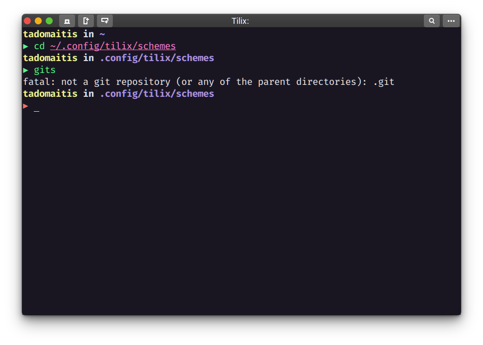

# Omni for [Tilix](https://gnunn1.github.io/tilix-web/)

## A [Dracula](https://draculatheme.com/tilix) based Dark Theme for Tilix Terminal Emulator

## Install

Install

1. Download using the GitHub .zip download option
2. Copy omni-tilix.json under ~/.config/tilix/schemes (first create directory if not exist)

#### Activating theme

1. Go to Preferences and select your Tilix profile
2. Select Colors tab
3. Select 'omni-tilix' from dropdown

## Tips

The screenshot shown is a combination of the following additional software:

- [Oh My Zsh](https://github.com/robbyrussell/oh-my-zsh)
- [Fast syntax highlighting](https://github.com/zdharma/fast-syntax-highlighting)

## Team

The editions on .json to match Omni pattern were done by [Thiago Adomaitis](https://github.com/tadomaitis).

Based on [Dracula](https://draculatheme.com/tilix) and the Omni [Hyper](https://github.com/getomni/hyper-omni) version maintained by [Rocketseat](https://github.com/Rocketseat) and [Mayk Brito](https://github.com/maykbrito).

Themes for other tools can be found [here](https://github.com/getomni).

## License

MIT License
